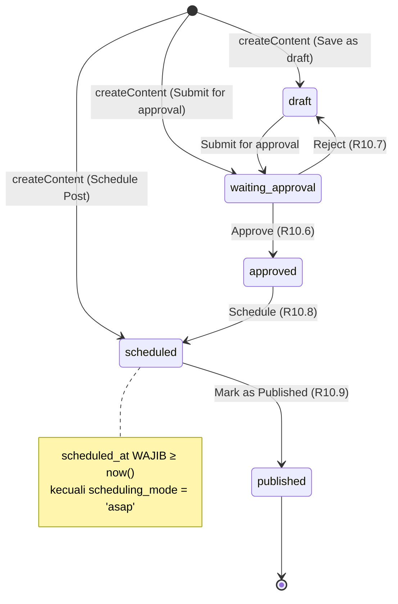
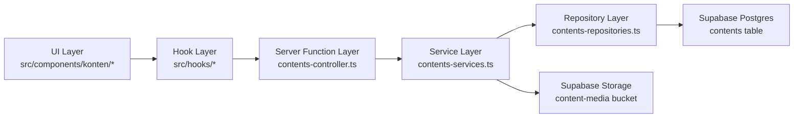

# Design Document

## Overview

Fitur **Manajemen Konten** adalah halaman terotentikasi `/konten` yang memungkinkan user EtalaseKu merencanakan post sosial media dalam tampilan kalendar mingguan ala Google Calendar (R1, R2). Halaman ini terdiri dari toolbar navigasi minggu + filter (R3, R4), grid 7 kolom × 24 baris jam (R2), dan panel detail slide-in dari kanan yang menampung form CRUD + preview platform (R5, R7, R8, R9). Workflow approval lima-status (`draft` → `waiting_approval` → `approved` → `scheduled` → `published`) di-drive manual oleh user (R10), tanpa auto-publish ke platform luar.

Data konten disimpan di tabel baru `contents` di Supabase (R13), file media di-upload ke bucket `content-media` (R6, R13.7), seluruh akses di-scope per user via Row Level Security (R11). API mengikuti pola modul existing (controller / service / repository / schema) di `src/server/modules/contents/` (R14).

Catatan keputusan utama (sesuai "Asumsi MVP" di requirements):
- Satu platform per konten (struktur DB siap untuk multi-platform di masa depan).
- Tidak ada auto-publish; status `published` di-flip user manual.
- Drag & drop reschedule tidak masuk MVP — reschedule via form.
- Day & Month view ditampilkan di dropdown tetapi disabled (R3.7).
- Tombol "Ask AI" disembunyikan / disabled untuk MVP.

## Architecture

### High-Level Flow

```mermaid
flowchart TB
    subgraph Browser["Browser (React 19 + TanStack Router)"]
        Sidebar["_authenticated.tsx (Sidebar Konten)"] -->|Link| Route["/_authenticated/konten.tsx"]
        Route --> KontenPage["KontenPage"]
        KontenPage --> Toolbar["ToolbarKalendar"]
        KontenPage --> Grid["GridKalendar"]
        KontenPage --> Panel["PanelDetailKonten"]
        Panel --> Form["FormKonten"]
        Panel --> Preview["PreviewPlatform"]
        Form --> Uploader["MediaUploader"]
    end

    subgraph Server["TanStack Start Server (Netlify Functions)"]
        AuthMW["authMiddleware<br/>(src/middleware/auth.ts)"]
        Controller["contents-controller.ts<br/>createServerFn handlers"]
        Service["contents-services.ts<br/>business logic"]
        Repository["contents-repositories.ts<br/>Supabase queries"]
        Schema["contents-schema.ts<br/>Zod validators"]
    end

    subgraph Supabase["Supabase Cloud"]
        Auth["Supabase Auth<br/>auth.uid()"]
        DB["Postgres<br/>table: contents (RLS)"]
        Storage["Storage Bucket<br/>content-media/"]
    end

    KontenPage -.loader / useServerFn.-> AuthMW
    Form -.useServerFn.-> AuthMW
    Uploader -.direct upload.-> Storage
    AuthMW --> Controller
    Controller -->|Zod parse| Schema
    Controller --> Service
    Service --> Repository
    Service -->|delete media on delete content| Storage
    Repository --> DB
    DB <-.RLS user_id = auth.uid().-> Auth
    Storage <-.policy path prefix auth.uid()/.-> Auth
```

Auth boundary dibatasi `authMiddleware` (R1.2, R11): semua server function untuk konten WAJIB melewati middleware ini dan menerima `user.id` via `context.user`. Repository kemudian memfilter setiap query dengan `eq('user_id', userId)`, dan RLS di Postgres menjadi defense-in-depth (R11.3, R11.4).

### Approval State Machine (R10)



### Module Layering



## Components and Interfaces

Implementasi mengikuti pola modul existing (`src/server/modules/contents/` sudah memiliki 4 file kosong yang akan diisi, bukan dibuat baru).

### 1. Routes & Pages

#### `src/routes/_authenticated/konten.tsx`

Satu file route TanStack Router untuk halaman utama. Tanggung jawab:
- Mendefinisikan `validateSearch` Zod untuk param `weekStart` (ISO date string), `platforms` (comma-separated), `status` (single string).
- `loader` memanggil `getContentsByDateRange` dengan range minggu terpilih + filter (R14.1, R2).
- `head` meta menampilkan title `Manajemen Konten | Etalaseku` (R1.3).
- Render `<KontenPage />`.

```ts
// signature ringkas
export const Route = createFileRoute('/_authenticated/konten')({
  validateSearch: kontenSearchSchema,        // see Schemas section
  loaderDeps: ({ search }) => ({ ...search }),
  loader: async ({ deps }) => {
    return await getContentsByDateRange({
      data: {
        start: weekStartIso(deps.weekStart),
        end:   weekEndIso(deps.weekStart),
        platforms: deps.platforms,
        status: deps.status,
      },
    })
  },
  head: () => ({ meta: [{ title: 'Manajemen Konten | Etalaseku' }] }),
  component: KontenPage,
})
```

URL search params menjadi single source of truth untuk minggu aktif & filter, sehingga state shareable / dapat di-bookmark (R3, R4).

### 2. UI Components (`src/components/konten/`)

Semua string Bahasa Indonesia. shadcn primitives di `src/components/ui/` digunakan langsung — tidak ada primitif custom.

#### `KontenPage` (orchestrator) — R1.3, R1.4, R1.5
- Layout: `flex flex-col` mengisi `<SidebarInset>`.
- Header: judul "Manajemen Konten" (R1.3) + tombol "+ Buat Konten" kanan atas (R1.4) → membuka `PanelDetailKonten` mode `create`.
- Body: render `<ToolbarKalendar />` di atas, `<GridKalendar />` di bawah.
- State terkoordinasi: `selectedContentId`, `panelMode` (`'closed' | 'create' | 'edit'`), `prefillSlot` (untuk klik slot kosong).

#### `ToolbarKalendar` — R3, R4
- Kiri: `Button` "Today" (R3.1, R3.4) + `Button` icon ChevronLeft (R3.3) + ChevronRight (R3.2).
- Tengah: label rentang tanggal `MMM d - MMM d` (R3.1) menggunakan `date-fns/format` dengan locale `id`.
- Kanan: `Select` view ("Week" aktif; "Day" & "Month" disabled dengan tooltip "Tersedia di versi mendatang" via `Tooltip`) (R3.5, R3.6, R3.7) + 4 ikon platform toggle (R4.1) + `Select` filter status (R4.7).
- Ikon platform menggunakan `Toggle` (shadcn) atau `Button variant="ghost"` dengan state `data-active` untuk warna/border berbeda (R4.3).
- Filter ikon platform: multi-select OR (R4.5); filter status: single-select (R4.7); kombinasi platform AND status (R4.10).
- Update filter → `navigate({ search: prev => ({ ...prev, ... }) })` agar URL-driven (debounce 0; perubahan ≤ 500 ms karena loader memanggil server function dengan cache TanStack Router) (R4.2, R4.8).

shadcn primitives terpakai: `button.tsx`, `select.tsx`, `dropdown-menu.tsx`, `toggle.tsx` (atau `toggle-group.tsx`), `tooltip.tsx`, `separator.tsx`.

#### `GridKalendar` — R2, R12
- Layout root: `grid grid-cols-[64px_repeat(7,minmax(0,1fr))]` (kolom 1: UTC offset + jam labels; kolom 2-8: hari Min-Sab).
- Header row di atas grid: tanggal + nama hari Bahasa Indonesia (Min, Sen, Sel, Rab, Kam, Jum, Sab) (R2.1, R2.5).
- Highlight kolom hari ini via class `bg-primary/5` jika `isToday(columnDate)` (R2.6).
- Kolom 1 berisi label `Intl.DateTimeFormat().resolvedOptions().timeZone` UTC offset (R2.4) di atas, lalu 24 baris jam (`00:00` - `23:00`).
- Body row: 24 row × 7 day, masing-masing slot fixed-height `h-16` (`64px`); container `overflow-y-auto`.
- Auto-scroll: `useScrollToHour(8)` saat mount (R2.3).
- Card placement: `CardKonten` ditempatkan di slot `dayIndex` (kolom) × jam `getHours(scheduled_at)` (row), stacked vertikal jika multiple di slot yang sama (`flex flex-col gap-1`) (R2.7, R2.10).
- Slot kosong on click → callback `onSlotClick(date, hour)` ke `KontenPage` untuk pre-fill form (R5.2).
- States:
  - Loading: `<KalendarSkeleton />` shimmer 24×7 menggunakan `skeleton.tsx`, durasi maks 10 detik (R12.1).
  - Error: `<KalendarErrorState />` dengan tombol "Coba Lagi" yang memanggil `router.invalidate()` (R2.9, R12.6).
  - Empty (akun benar-benar kosong, bukan minggu kosong): overlay `<EmptyStateKalendar />` dengan tombol "Buat Konten Pertama" (R12.3). Cek dilakukan via call ringan `getContentsCount` atau via flag dari loader.
  - Empty (filter tidak match): overlay teks "Tidak ada konten yang cocok dengan filter" (R4.11).
  - Empty (minggu ini kosong tapi user punya konten lain): grid kosong tanpa overlay (R12.2).

shadcn primitives terpakai: `skeleton.tsx`, `button.tsx`, `scroll-area.tsx` (opsional).

#### `CardKonten` — R2.7, R10.10
- Ukuran: `h-15 w-full rounded-md border` di dalam slot (sedikit lebih kecil dari slot agar gap terlihat).
- Layout: `[thumbnail 32×32] [icon platform 14×14] [time HH:mm] [badge status]`.
- Thumbnail: `` dari `media_urls[0]` dengan `aspect-square object-cover`; fallback ikon placeholder bila kosong.
- Ikon platform: `lucide-react` → Instagram/Facebook icon, `simple-icons`-style SVG inline untuk TikTok/Twitter (X) karena `lucide-react` tidak meng-cover. Note: jika tidak tersedia di lucide, simpan SVG resmi di `src/components/konten/platform-icons/`.
- Badge status: `badge.tsx` dengan varian per status (lihat tabel warna di Data Models → "Status badge tokens").
- Cursor: `cursor-pointer`; hover: `hover:bg-accent transition-colors duration-200` (no scale shift per UI rules).
- onClick → `onCardClick(content.id)` membuka panel mode edit (R7.1).

shadcn primitives terpakai: `badge.tsx`, plus utility `cn`.

#### `PanelDetailKonten` — R5, R7, R8, R9
- Reuse `sheet.tsx` (sudah ada). `<Sheet open={panelMode !== 'closed'} onOpenChange={...}>` + `<SheetContent side="right" className="w-full sm:max-w-2xl">`.
- Layout dalam content: vertical flex `[Header][BodyScroll][Footer]`.
- Header: `SheetTitle` "Detail Konten" (R7.2) + ikon trash kanan atas membuka konfirmasi delete (R9.1).
  - Mode create: judul jadi "Buat Konten" + ikon trash hidden.
- Body: dua kolom pada `≥ md`: kiri `<FormKonten />`, kanan `<PreviewPlatform />` (R7.3).
- Footer: status pill `{PLATFORM} | {STATUS}` (R7.6) + tombol prev/next (R7.7) + tombol aksi state-machine (Approve/Reject/Schedule/Mark as Published) (R10.5–R10.9).
- Prev/Next traversal mengikuti urutan `scheduled_at ASC` dari **hasil filter aktif saat ini** (R7.8, R7.9), disabled di ujung (R7.10, R7.11). Implemented via `useContentNavigation(filteredList, currentId)`.
- Close panel saat dirty form → `useUnsavedChangesGuard` pop `<Dialog>` "Buang perubahan?" (R8.5).
- Konfirmasi delete: `<AlertDialog>` (atau `Dialog`) "Hapus konten ini?" + tombol "Hapus" / "Batal" (R9.1, R9.2). Tombol disabled selama delete in-flight (R9.3); error → toast + dialog tetap terbuka (R9.6).

shadcn primitives terpakai: `sheet.tsx`, `dialog.tsx`, `alert-dialog.tsx`, `button.tsx`, `tooltip.tsx`, `separator.tsx`, `sonner.tsx` (toast).

#### `FormKonten` — R5, R6, R8
- Wrapper: `react-hook-form` + `@hookform/resolvers/zod` dengan `formKontenSchema` (lihat Schemas).
- Section "Date and post time":
  - `Tabs` (`tabs.tsx`) dengan dua trigger: `CUSTOM TIME` & `AS SOON AS POSSIBLE` (R5.3).
  - Tab CUSTOM TIME: `Popover` + `Calendar` (`calendar.tsx`) untuk date picker, `Input type="time"` untuk time (R5.5).
  - Tab ASAP: date/time picker disabled (R5.4).
  - Validasi: jika CUSTOM TIME aktif, `scheduled_at` wajib dan ≥ `now()` (R5.12, R5.13).
- Section "Media": grid 5-kolom thumbnail, indikator `(N/10)` (R5.6, R6.4), tombol `+` di slot kosong → trigger file input `accept="image/*" multiple` (R6.1).
- Section "Caption": `Textarea` (`textarea.tsx`) `rows=8` placeholder "Tulis caption di sini..." (R5.7).
- Field Platform: `Select` opsi Instagram / Facebook / TikTok / Twitter (R5.8). Validasi wajib (R5.11).
- Field Produk: `Combobox` (`combobox.tsx` + `command.tsx`) populated dari `getAllProducts()` filter `user_id = current`. Opsi paling atas `(Tanpa produk)` mapped ke `null` (R5.9).
- Footer aksi (mode create): tombol "Submit for approval" (variant secondary, status `waiting_approval`) + "Schedule Post" (variant primary, status `scheduled`) (R5.10). Plus opsional "Save as draft" (R10.4).
- Footer aksi (mode edit): tombol "Save" disabled hingga form dirty (R8.3) + tombol state-machine sesuai status (R10.5–R10.9).
- Submit: `useServerFn(createContent)` / `useServerFn(updateContent)`. Loading state: spinner di tombol, semua tombol submit disabled (R12.4). Timeout client-side 30s (R12.4, R12.7).

shadcn primitives terpakai: `form.tsx`, `tabs.tsx`, `popover.tsx`, `calendar.tsx`, `input.tsx`, `textarea.tsx`, `select.tsx`, `combobox.tsx`, `command.tsx`, `button.tsx`, `label.tsx`, `field.tsx`.

#### `PreviewPlatform` + `InstagramPreview` — R7.4, R7.5
- `PreviewPlatform` adalah dispatcher: `switch(platform)` → render preview komponen sesuai platform.
- `InstagramPreview` (MVP):
  - Header: label "INSTAGRAM" + username `Tenant_User.user_metadata.username || email.split('@')[0]` + avatar.
  - Badge status di pojok kanan header (R7.5) — warna sesuai token status.
  - Body: `aspect-ratio.tsx` `aspect-[1/1]` menampilkan `media_urls[0]`. Bila `length > 1`, indikator dot carousel (read-only).
  - Action row: ikon like / comment / share (lucide).
  - Caption preview di bawah, line-clamp 3 dengan "...lainnya".
- Platform lain (Facebook, TikTok, Twitter): MVP me-render generic preview placeholder. Future work.

shadcn primitives terpakai: `aspect-ratio.tsx`, `badge.tsx`, `avatar.tsx`.

#### `MediaUploader` — R6
- Props: `value: string[]`, `onChange: (urls: string[]) => void`, `contentId?: number` (untuk path; jika undefined gunakan `temp/${cuid}`).
- Klik tombol `+` → `<input type="file" accept="image/*" multiple hidden>` (R6.1).
- Per file:
  1. Validasi MIME `image/*` (R6.6) dan size ≤ 5 MB (R6.7).
  2. Cek `value.length + queue.length < 10` (R6.5).
  3. Upload langsung ke Storage via `supabase.storage.from('content-media').upload(...)` di client. Path: `${userId}/${contentId ?? 'temp'}/${crypto.randomUUID()}.${ext}` (R6.2).
  4. Tampilkan spinner di slot thumbnail (R6.10) + progress numerik 0–100 (R12.5) dari `uploadProgress` event.
  5. Setelah selesai, panggil `getPublicUrl(path)` → push ke `value`.
- Klik thumbnail → tampilkan tombol X (R6.8). Klik X → hapus file dari Storage + `onChange(value.without(url))` (R6.9).
- Untuk `temp/` path, file di-promote ke `${userId}/${newContentId}/...` saat content baru dibuat (server function akan rename via Storage move, atau tetap di-temp dengan TTL cleanup di service). MVP: keep temp path; cukup karena tetap unik.

shadcn primitives terpakai: `button.tsx`, `progress.tsx`, `tooltip.tsx`, `spinner.tsx`.

#### `EmptyStateKalendar`, `KalendarSkeleton`, `KalendarErrorState`
- `EmptyStateKalendar`: ikon ilustratif + teks "Belum ada konten" + tombol "Buat Konten Pertama" (R12.3).
- `KalendarSkeleton`: 24 row × 7 col placeholder shimmer reusing `skeleton.tsx` (R12.1).
- `KalendarErrorState`: pesan + `Button` "Coba Lagi" → `router.invalidate({ filter: m => m.routeId === '/_authenticated/konten' })` (R2.9, R12.6).

### 3. Hooks (`src/hooks/`)

| Hook | Tanggung jawab | Requirement IDs |
|------|----------------|-----------------|
| `useWeekRange(weekStartIso?: string)` | Hitung `{ start: Date, end: Date, days: Date[] }` Sunday→Saturday dari ISO date; default minggu hari ini. | R2.1, R3.1, R3.4 |
| `useScrollToHour(hour: number)` | `useLayoutEffect` scroll ke `row` jam tertentu sekali pada mount. | R2.3 |
| `useKontenFilters()` | Wrapper di atas `useSearch` untuk baca/tulis platform + status filter. | R4 |
| `useContentNavigation(list, currentId)` | Hitung prev/next id berdasarkan urutan list yang sudah ter-sort `scheduled_at ASC`. Return `{ prev, next, isFirst, isLast }`. | R7.8–R7.11 |
| `useUnsavedChangesGuard(isDirty, onConfirm)` | Tampilkan `Dialog` saat user klik close panel + `isDirty`. | R8.5 |

### 4. Server Functions (`src/server/modules/contents/contents-controller.ts`)

Semua server function memakai `authMiddleware` agar `context.user.id` tersedia.

```ts
// Pseudocode signatures (tidak final code)

export const getContentsByDateRange = createServerFn({ method: 'GET' })
  .middleware([authMiddleware])
  .inputValidator(getContentsByDateRangeSchema)
  .handler(async ({ data, context }) => {
    return await contentService.listByDateRange(context.user.id, data)
  })
// returns: ContentRow[]
// satisfies: R2.1, R2.7, R3, R4, R11.1, R14.1

export const getContentById = createServerFn({ method: 'GET' })
  .middleware([authMiddleware])
  .inputValidator(z.object({ id: z.number().int().positive() }))
  .handler(async ({ data, context }) => {
    return await contentService.getById(context.user.id, data.id)
  })
// returns: ContentRow
// satisfies: R7.1, R11.3, R14.2

export const createContent = createServerFn({ method: 'POST' })
  .middleware([authMiddleware])
  .inputValidator(createContentSchema)
  .handler(async ({ data, context }) => {
    return await contentService.create(context.user.id, data)
  })
// returns: ContentRow
// satisfies: R5.14, R5.15, R10.2, R10.3, R10.4, R11.2, R14.3

export const updateContent = createServerFn({ method: 'POST' })
  .middleware([authMiddleware])
  .inputValidator(updateContentSchema)
  .handler(async ({ data, context }) => {
    const { id, ...patch } = data
    return await contentService.update(context.user.id, id, patch)
  })
// returns: ContentRow
// satisfies: R8.2, R8.4, R11.3, R14.4

export const deleteContent = createServerFn({ method: 'POST' })
  .middleware([authMiddleware])
  .inputValidator(z.object({ id: z.number().int().positive() }))
  .handler(async ({ data, context }) => {
    return await contentService.deleteWithMedia(context.user.id, data.id)
  })
// returns: { id: number }
// satisfies: R9.3, R9.4, R11.3, R14.5

export const updateContentStatus = createServerFn({ method: 'POST' })
  .middleware([authMiddleware])
  .inputValidator(updateContentStatusSchema)
  .handler(async ({ data, context }) => {
    return await contentService.transitionStatus(context.user.id, data.id, data.status)
  })
// returns: ContentRow
// satisfies: R10.5–R10.9, R11.3, R14.6
```

Validasi gagal Zod menghasilkan HTTP 400 dengan body `{ field, message }[]` (R14.8).

### 5. Service Layer (`contents-services.ts`)

```ts
export const contentService = {
  listByDateRange(userId, { start, end, platforms, status }) {
    return contentRepository.findByRange(userId, { start, end, platforms, status })
  },

  getById(userId, id) {
    const row = await contentRepository.findById(userId, id)
    if (!row) throw new Error('Tidak memiliki akses')      // R11.3
    return row
  },

  async create(userId, payload) {
    const scheduledAt =
      payload.scheduling_mode === 'asap'
        ? new Date().toISOString()                          // R-MVP: ASAP = now
        : payload.scheduled_at
    return contentRepository.insert({
      ...payload,
      user_id: userId,                                     // R11.2
      scheduled_at: scheduledAt,
    })
  },

  async update(userId, id, patch) {
    // Repository sudah enforce user_id; service hanya pass-through.
    return contentRepository.update(userId, id, patch)
  },

  async transitionStatus(userId, id, nextStatus) {
    const current = await contentRepository.findById(userId, id)
    if (!current) throw new Error('Tidak memiliki akses')
    assertValidTransition(current.status, nextStatus)      // R10 state machine
    return contentRepository.update(userId, id, { status: nextStatus })
  },

  async deleteWithMedia(userId, id) {
    const row = await contentRepository.findById(userId, id)
    if (!row) throw new Error('Tidak memiliki akses')
    const paths = row.media_urls.map(extractStoragePath)   // strip public URL prefix
    if (paths.length) {
      await supabase.storage.from('content-media').remove(paths)   // R9.4
    }
    await contentRepository.delete(userId, id)
    return { id }
  },
}
```

`assertValidTransition` adalah pure function kecil yang menerapkan state machine R10 (lihat diagram). Transisi invalid → `Error('Transisi status tidak valid')`.

### 6. Repository Layer (`contents-repositories.ts`)

```ts
export const contentRepository = {
  async findByRange(userId, { start, end, platforms, status }) {
    let q = supabase.from('contents').select('*')
      .eq('user_id', userId)                              // R11.1
      .gte('scheduled_at', start)
      .lt('scheduled_at', end)
      .order('scheduled_at', { ascending: true })
    if (platforms?.length) q = q.in('platform', platforms) // R4.5
    if (status)            q = q.eq('status', status)      // R4.8
    const { data, error } = await q
    if (error) throw new Error(error.message)
    return data ?? []
  },

  async findById(userId, id) {
    const { data, error } = await supabase.from('contents')
      .select('*').eq('user_id', userId).eq('id', id).maybeSingle()
    if (error) throw new Error(error.message)
    return data
  },

  async insert(row) {
    const { data, error } = await supabase.from('contents')
      .insert(row).select().single()
    if (error) throw new Error(error.message)
    return data
  },

  async update(userId, id, patch) {
    const { data, error } = await supabase.from('contents')
      .update(patch).eq('user_id', userId).eq('id', id)
      .select().single()
    if (error) throw new Error(error.message)
    return data
  },

  async delete(userId, id) {
    const { error } = await supabase.from('contents')
      .delete().eq('user_id', userId).eq('id', id)
    if (error) throw new Error(error.message)
  },
}
```

Semua query meng-enforce `user_id = userId` di application layer; RLS Postgres adalah lapisan kedua (R11.4).

### 7. Schemas (`contents-schema.ts`)

```ts
import { z } from 'zod'

export const platformEnum = z.enum(['instagram', 'facebook', 'tiktok', 'twitter'])
export const statusEnum   = z.enum(['draft', 'waiting_approval', 'approved', 'scheduled', 'published'])
export const schedulingModeEnum = z.enum(['custom_time', 'asap'])

const baseFields = {
  caption: z.string().max(5000).nullable().optional(),
  platform: platformEnum,                                 // R5.11 wajib
  product_id: z.number().int().positive().nullable().optional(),
  media_urls: z.array(z.string().url()).max(10).default([]), // R6.5
  scheduling_mode: schedulingModeEnum.default('custom_time'),
  scheduled_at: z.string().datetime().optional(),         // R5.12, R5.13
  status: statusEnum.default('draft'),
}

export const createContentSchema = z.object(baseFields).superRefine((v, ctx) => {
  if (v.scheduling_mode === 'custom_time') {
    if (!v.scheduled_at) {
      ctx.addIssue({ code: 'custom', path: ['scheduled_at'],
        message: 'Tanggal dan jam wajib dipilih' })       // R5.12
    } else if (new Date(v.scheduled_at).getTime() < Date.now()) {
      ctx.addIssue({ code: 'custom', path: ['scheduled_at'],
        message: 'Tanggal dan jam tidak boleh di masa lalu' }) // R5.13
    }
  }
})

export const updateContentSchema = z.object({
  id: z.number().int().positive(),
  caption: z.string().max(5000).nullable().optional(),
  platform: platformEnum.optional(),
  product_id: z.number().int().positive().nullable().optional(),
  media_urls: z.array(z.string().url()).max(10).optional(),
  scheduling_mode: schedulingModeEnum.optional(),
  scheduled_at: z.string().datetime().optional(),
  status: statusEnum.optional(),
})

export const updateContentStatusSchema = z.object({
  id: z.number().int().positive(),
  status: statusEnum,
})

export const getContentsByDateRangeSchema = z.object({
  start: z.string().datetime(),
  end:   z.string().datetime(),
  platforms: z.array(platformEnum).optional(),            // multi-select OR
  status:    statusEnum.optional(),                       // single-select
})

// Search params untuk URL route — separate dari createContent
export const kontenSearchSchema = z.object({
  weekStart: z.string().date().optional(),                // ISO yyyy-mm-dd
  platforms: z.array(platformEnum).optional(),
  status: statusEnum.optional(),
})

export type ContentRow      = Database['public']['Tables']['contents']['Row']
export type CreateContentIn = z.infer<typeof createContentSchema>
export type UpdateContentIn = z.infer<typeof updateContentSchema>
```

### 8. Sidebar Integration — R15

`src/routes/_authenticated.tsx` saat ini sudah punya entry "Konten" tapi mengarah ke `/dashboard`. Ubah:

```tsx
const navItems = [
  { title: 'Dashboard', icon: LayoutDashboard, to: '/dashboard' as const },
  { title: 'Produk',    icon: Package,         to: '/dashboard' as const },
  { title: 'Konten',    icon: FileText,        to: '/konten'    as const }, // R15.1
  { title: 'Landing Page', icon: Globe,        to: '/dashboard' as const },
]
```

`SidebarMenuButton` shadcn sudah meng-handle styling aktif via prop `isActive` (TanStack Router `useMatch` deteksi pathname `/konten`) — R15.3. Klik link → router navigate (R15.2).

## Data Models

### Tabel `contents` (DDL) — R13.1

```sql
create table public.contents (
  id              bigint primary key generated always as identity,
  user_id         uuid not null references auth.users(id) on delete cascade,
  product_id      bigint references public.products(id) on delete set null,
  caption         text,
  platform        text not null,
  media_urls      text[] not null default '{}'::text[],
  scheduled_at    timestamptz,
  scheduling_mode text not null default 'custom_time',
  status          text not null default 'draft',
  created_at      timestamptz not null default now(),
  updated_at      timestamptz not null default now(),

  constraint contents_platform_check
    check (platform in ('instagram','facebook','tiktok','twitter')),     -- R13.2
  constraint contents_status_check
    check (status in ('draft','waiting_approval','approved','scheduled','published')), -- R13.3
  constraint contents_scheduling_mode_check
    check (scheduling_mode in ('custom_time','asap')),                   -- R13.4
  constraint contents_media_urls_max
    check (cardinality(media_urls) <= 10)                                -- defense for R6.5
);

create index contents_user_scheduled_at_idx
  on public.contents (user_id, scheduled_at);                            -- R13.5
```

### Trigger `updated_at` — R13.6

```sql
create or replace function public.set_updated_at()
returns trigger language plpgsql as $$
begin
  new.updated_at = now();
  return new;
end;
$$;

create trigger contents_set_updated_at
before update on public.contents
for each row execute function public.set_updated_at();
```

### Row Level Security — R11.4

```sql
alter table public.contents enable row level security;

create policy "contents_select_own"
  on public.contents for select using (user_id = auth.uid());

create policy "contents_insert_own"
  on public.contents for insert with check (user_id = auth.uid());

create policy "contents_update_own"
  on public.contents for update using (user_id = auth.uid())
                          with check (user_id = auth.uid());

create policy "contents_delete_own"
  on public.contents for delete using (user_id = auth.uid());
```

### Storage Bucket `content-media` — R6.2, R13.7

```sql
insert into storage.buckets (id, name, public)
values ('content-media', 'content-media', true)
on conflict (id) do nothing;

-- SELECT: any authenticated user can read files from their own folder
create policy "content_media_select_own"
  on storage.objects for select to authenticated
  using (
    bucket_id = 'content-media'
    and (storage.foldername(name))[1] = auth.uid()::text
  );

create policy "content_media_insert_own"
  on storage.objects for insert to authenticated
  with check (
    bucket_id = 'content-media'
    and (storage.foldername(name))[1] = auth.uid()::text
  );

create policy "content_media_update_own"
  on storage.objects for update to authenticated
  using (
    bucket_id = 'content-media'
    and (storage.foldername(name))[1] = auth.uid()::text
  );

create policy "content_media_delete_own"
  on storage.objects for delete to authenticated
  using (
    bucket_id = 'content-media'
    and (storage.foldername(name))[1] = auth.uid()::text
  );
```

Karena bucket di-set `public = true`, public URL hasil `getPublicUrl(path)` dapat di-render `` tanpa signed URL. Akses tulis tetap tergated via policy.

### Migration File Outline

Letakkan satu migration di `supabase/migrations/<timestamp>_create_contents.sql`. Urutan:
1. Create `contents` table + check constraints + index (R13.1–R13.5).
2. Create `set_updated_at()` function + trigger (R13.6).
3. Enable RLS + policies (R11.4).
4. Insert bucket `content-media` + storage policies (R13.7).

Setelah migration di-apply, jalankan `bun run supabase:gen-types` agar `database.types.ts` ikut terupdate (tabel `contents` belum ada di file types saat ini, akan auto-generated).

### Status Badge Tokens (R7.5, R10.10)

| Status | Label UI | Tailwind class (light) | Tailwind class (dark) |
|--------|----------|------------------------|-----------------------|
| `draft`            | DRAFT                | `bg-slate-100 text-slate-700 border-slate-200`      | `bg-slate-800 text-slate-200 border-slate-700` |
| `waiting_approval` | WAITING FOR APPROVAL | `bg-amber-100 text-amber-800 border-amber-200`      | `bg-amber-900/40 text-amber-200 border-amber-800` |
| `approved`         | APPROVED             | `bg-emerald-100 text-emerald-800 border-emerald-200`| `bg-emerald-900/40 text-emerald-200 border-emerald-800` |
| `scheduled`        | SCHEDULED            | `bg-sky-100 text-sky-800 border-sky-200`            | `bg-sky-900/40 text-sky-200 border-sky-800` |
| `published`        | PUBLISHED            | `bg-violet-100 text-violet-800 border-violet-200`   | `bg-violet-900/40 text-violet-200 border-violet-800` |

## State Management

| State | Storage | Why |
|-------|---------|-----|
| `weekStart` (Sun ISO date) | URL search param via `validateSearch` | Shareable, browser back/forward works (R3.1–R3.4) |
| `platforms` (string[]) | URL search param | Filter persists across reload (R4.1–R4.6) |
| `status` (string \| undefined) | URL search param | Same (R4.7–R4.10) |
| `selectedContentId` | local state in `KontenPage` | UI-only; tidak perlu shareable URL |
| `panelMode` (`'closed' \| 'create' \| 'edit'`) | local state | Transient panel state |
| `prefillSlot` ({ date, hour }) | local state | Slot click pre-fill (R5.2) |
| Form fields | `react-hook-form` internal | Standard form lifecycle |
| `formIsDirty` | derived dari `formState.isDirty` | Untuk Save button + unsaved guard (R8.3, R8.5) |
| Media upload queue & progress | local component state in `MediaUploader` | Tidak perlu lift; ephemeral (R12.5) |

URL state bersifat **single source of truth** untuk minggu + filter — perubahan filter / minggu memicu loader rerun via TanStack Router `loaderDeps`, tidak butuh global state lib. Loader cache TanStack Router (`staleTime` ~30 detik) menjaga response 500 ms requirement (R4.2, R4.8).

## API Contracts

| Server Function | Input (Zod) | Output | Requirements |
|----------------|-------------|--------|--------------|
| `getContentsByDateRange` | `{ start: ISODate, end: ISODate, platforms?: PlatformEnum[], status?: StatusEnum }` (`getContentsByDateRangeSchema`) | `ContentRow[]` ordered `scheduled_at ASC` | R2.7, R3, R4.5, R4.8, R4.10, R11.1, R14.1 |
| `getContentById` | `{ id: number }` | `ContentRow` | R7.1, R11.3, R14.2 |
| `createContent` | `createContentSchema` (caption, platform, media_urls, product_id?, scheduling_mode, scheduled_at?, status default `'draft'`) | `ContentRow` | R5.14, R5.15, R10.2–R10.4, R11.2, R14.3 |
| `updateContent` | `updateContentSchema` (id + partial fields) | `ContentRow` | R8.2, R8.4, R11.3, R14.4 |
| `deleteContent` | `{ id: number }` | `{ id: number }` | R9.3, R9.4, R11.3, R14.5 |
| `updateContentStatus` | `{ id: number, status: StatusEnum }` | `ContentRow` | R10.5–R10.9, R11.3, R14.6 |

Semua server function mengembalikan HTTP 400 dengan field-level error message saat input gagal Zod (R14.8). Akses cross-tenant (id ada tapi `user_id` mismatch) → 403/404 dengan pesan "Tidak memiliki akses" (R11.3).


## Correctness Properties

*A property is a characteristic or behavior that should hold true across all valid executions of a system — essentially, a formal statement about what the system should do. Properties serve as the bridge between human-readable specifications and machine-verifiable correctness guarantees.*

Properti di bawah adalah hasil konsolidasi dari prework analysis (lihat tugas Testing Strategy). Setiap property akan diimplementasikan sebagai satu test fast-check minimum 100 iterasi dan diberi tag `Feature: manajemen-konten, Property {N}: {text}`.

### Property 1: Week range arithmetic

*For any* ISO date `D` (within ±20 tahun dari `now`), `useWeekRange(D)` mengembalikan tepat 7 hari kontinu dengan `days[0]` adalah Minggu (`getDay() === 0`), `days[6]` adalah Sabtu (`getDay() === 6`), dan untuk setiap `i ∈ [0, 5]`, `days[i+1] - days[i] = 24 jam` di timezone lokal user (toleran terhadap DST). Operasi `nextWeek` dan `prevWeek` saling invers: `prevWeek(nextWeek(D)) ≡ weekStart(D)`.

**Validates: Requirements 2.1, 3.2, 3.3, 3.4**

### Property 2: Card slot placement

*For any* daftar `contents: ContentRow[]` dengan `scheduled_at` di dalam minggu aktif `W`, fungsi `placeCards(contents, W)` menempatkan setiap card pada slot `(dayIndex, hour)` di mana `dayIndex = differenceInDays(scheduled_at, W.start)` dan `hour = getHours(scheduled_at)`; jika dua atau lebih card berbagi slot, urutan render mengikuti `scheduled_at ASC`.

**Validates: Requirements 2.7, 2.10**

### Property 3: Filter composition (platform OR ∧ status equality)

*For any* daftar konten `C: ContentRow[]`, set platform aktif `P ⊆ {instagram, facebook, tiktok, twitter}`, dan status filter `s ∈ Status ∪ {undefined}`, hasil `applyFilters(C, P, s)` sama persis dengan `C.filter(c => (P.size === 0 || P.includes(c.platform)) && (s === undefined || c.status === s))`. Toggling filter dua kali pada nilai yang sama (idempotent) mengembalikan state filter ke semula.

**Validates: Requirements 4.3, 4.4, 4.5, 4.6, 4.8, 4.9, 4.10**

### Property 4: createContentSchema validation correctness

*For any* objek input `i` yang valid (memiliki `platform`, `media_urls.length ≤ 10`, dan jika `scheduling_mode === 'custom_time'` maka `scheduled_at` ada dan `≥ now()`), `createContentSchema.safeParse(i).success === true`. Sebaliknya, untuk input yang melanggar **salah satu** dari constraint tersebut, `safeParse(i).success === false` dengan field error path yang menunjuk ke constraint yang dilanggar.

**Validates: Requirements 5.11, 5.12, 5.13, 6.5, 14.7, 14.8**

### Property 5: Intent → status mapping on create

*For any* valid create input `i` dan tombol intent `b ∈ {schedulePost, submitForApproval, saveAsDraft}`, hasil `createContent` menghasilkan row dengan `status` tepat sama dengan `STATUS_FOR_INTENT[b]`, dimana `STATUS_FOR_INTENT = { schedulePost: 'scheduled', submitForApproval: 'waiting_approval', saveAsDraft: 'draft' }`.

**Validates: Requirements 5.14, 5.15, 10.2, 10.3, 10.4**

### Property 6: Status transition state machine

*For any* status saat ini `s` dan target `s'`, `assertValidTransition(s, s')` lulus jika dan hanya jika `(s, s') ∈ ALLOWED_TRANSITIONS` dimana `ALLOWED_TRANSITIONS = { (draft, waiting_approval), (waiting_approval, approved), (waiting_approval, draft), (approved, scheduled), (scheduled, published) }`. Setiap transisi yang lulus menghasilkan row dengan `updated_at_after > updated_at_before`.

**Validates: Requirements 10.6, 10.7, 10.8, 10.9, 10.11**

### Property 7: Update merges patch and advances updated_at

*For any* row `C` dan partial patch `P` (subset dari kolom yang dapat diupdate), hasil `contentRepository.update(userId, C.id, P)` mengembalikan row `C'` dengan `C' = { ...C, ...P, updated_at: t' }` dan `t' > C.updated_at` (strict inequality). Field yang tidak ada di `P` tidak berubah.

**Validates: Requirements 8.2, 10.11**

### Property 8: Media admissibility predicate

*For any* current `media_urls.length = N ∈ [0, 10]` dan kandidat file `f` dengan `f.mime` dan `f.size`, fungsi `acceptMedia(N, f)` mengembalikan `true` jika dan hanya jika `f.mime.startsWith('image/') ∧ f.size ≤ 5 * 1024 * 1024 ∧ N + 1 ≤ 10`. Setelah `appendMedia(currentList, f)` pada `f` yang accepted, panjang list bertambah 1 dan tidak pernah melebihi 10.

**Validates: Requirements 6.5, 6.6, 6.7**

### Property 9: Tenant isolation invariant

*For any* dua user `A ≠ B` dan setiap operasi `op ∈ { findByRange, findById, update, delete }`, panggilan `op` dengan `userId = A` tidak pernah mengembalikan, memodifikasi, atau menghapus row yang `user_id = B`. `insert(payload)` di context user `A` selalu menghasilkan row dengan `user_id = A`, tanpa memandang nilai `user_id` di payload (server overrides).

**Validates: Requirements 11.1, 11.2, 11.3**

### Property 10: useContentNavigation traversal

*For any* list konten ter-filter `L` ter-sort `scheduled_at ASC` dan `currentId ∈ L.map(c => c.id)`, `useContentNavigation(L, currentId)` menghasilkan:
- `prev = L[indexOf(currentId) - 1] ?? null`
- `next = L[indexOf(currentId) + 1] ?? null`
- `isFirst = (indexOf(currentId) === 0)`
- `isLast = (indexOf(currentId) === L.length - 1)`

Selain itu, traversal `next` dari `L[0]` melalui semua `next` mengunjungi setiap elemen `L` tepat sekali sampai `isLast`.

**Validates: Requirements 7.8, 7.9, 7.10, 7.11**

### Property 11: Delete cleans Storage and DB atomically (best-effort)

*For any* row `C` dengan `media_urls = [u1, u2, ..., un]` (n ∈ [0, 10]), pemanggilan `deleteWithMedia(userId, C.id)`:
1. Memanggil `supabase.storage.from('content-media').remove(paths)` dengan `paths` adalah set Storage path yang di-extract dari setiap `ui` (urutan tidak penting).
2. Memanggil `contentRepository.delete(userId, C.id)`.
3. Setelah sukses, `findById(userId, C.id)` mengembalikan `null`.

Jika storage remove gagal, DB delete tidak dilakukan dan error dipropagasi ke client (R9.6).

**Validates: Requirements 6.9, 9.3, 9.4**

## Error Handling

| Skenario | UI feedback | Mekanisme |
|----------|-------------|-----------|
| Loading awal grid | Skeleton 7×24 + animasi shimmer; interaksi grid disabled | `KalendarSkeleton` + `pendingComponent` di route (R12.1) |
| Loading > 10 detik | Auto-replace skeleton dengan `KalendarErrorState` "Gagal memuat data" + tombol "Coba Lagi" | `Promise.race` di loader dengan timeout 10s (R12.6) |
| Loader error | `errorComponent` route render `KalendarErrorState` | TanStack Router `errorComponent` (R2.9, R12.6) |
| Empty: akun benar-benar kosong | Overlay `EmptyStateKalendar` + tombol "Buat Konten Pertama" | Cek `totalCount === 0` flag dari loader (R12.3) |
| Empty: minggu kosong tapi ada di minggu lain | Grid kosong tanpa overlay; slot tetap clickable | Cek `weekCount === 0 && totalCount > 0` (R12.2) |
| Empty: filter tidak match | Overlay teks "Tidak ada konten yang cocok dengan filter" | Cek `weekCount === 0 && (filters.platforms.length > 0 \|\| filters.status)` (R4.11) |
| Validasi form Zod gagal | Pesan error inline di field (`<FormMessage>`) sesuai `superRefine` message | `react-hook-form` + `@hookform/resolvers/zod` (R5.11–R5.13, R14.8) |
| Submit network/server error | Toast (sonner) `Gagal menyimpan konten: <msg>`; tombol re-enabled; input dipertahankan | `try/catch` di handler submit + `toast.error(...)` (R5.17, R8.6, R12.7) |
| Submit > 30 detik | Tombol re-enabled, spinner hidden, toast "Permintaan terlalu lama, coba lagi" | `AbortController` dengan timeout 30s (R12.7) |
| Upload media gagal | Spinner di slot diganti ikon error retry; `media_urls` tidak ditambahkan | Per-file try/catch di `MediaUploader` (R6, R12.5) |
| Upload melebihi cap (> 10) | Toast "Maksimum 10 media per konten"; file ditolak | Pre-validation di `acceptMedia` (R6.5) |
| Upload non-image | Toast "Hanya file gambar yang diperbolehkan" | Pre-validation MIME (R6.6) |
| Upload > 5 MB | Toast "Ukuran file maksimum 5 MB" | Pre-validation size (R6.7) |
| Delete gagal / > 5 detik | Toast error (≥ 3 detik), dialog tetap terbuka, tombol Hapus/Batal di-enable kembali | `try/catch` + `AbortController` 5s (R9.6) |
| RLS rejection / cross-tenant | Toast "Tidak memiliki akses"; panel ditutup; `router.invalidate()` | Server function throw `Error('Tidak memiliki akses')` mapped ke 403 (R11.3) |
| Status transisi invalid | Toast "Transisi status tidak valid" | `assertValidTransition` throw → ditangkap di handler aksi (R10) |

Toast strategy: gunakan `sonner.tsx` (sudah ada). Posisi `bottom-right` (R5.16). Sukses: hijau, durasi 3 detik. Error: merah, durasi 5 detik (delete error: ≥ 3 detik).

## Testing Strategy

**Dual approach**: property-based tests untuk universal invariants, example/integration tests untuk specific UI behaviors dan smoke checks. Library: **fast-check** (untuk PBT) + **Vitest 4** + **@testing-library/react 16** + **jsdom** (sudah di package.json).

### Property-based tests (fast-check, ≥ 100 iterations each)

Letakkan di `src/server/modules/contents/__tests__/*.property.test.ts` (untuk pure logic) atau `src/components/konten/__tests__/*.property.test.ts` (untuk UI helpers). Tag setiap test:

```ts
// Feature: manajemen-konten, Property 1: Week range arithmetic
test.prop([fc.date({ min: new Date('2005-01-01'), max: new Date('2045-12-31') })])(
  'Property 1: useWeekRange returns 7 contiguous days Sun→Sat',
  (d) => { ... }
)
```

| Test | Property | Generator |
|------|----------|-----------|
| `weekRange.property.test.ts` | P1 Week range arithmetic | `fc.date` ±20y; check DST transitions |
| `placeCards.property.test.ts` | P2 Card slot placement | `fc.array(contentArbitrary)` within week |
| `filters.property.test.ts` | P3 Filter composition | `fc.array(contentArbitrary)` + `fc.subarray(platforms)` + `fc.option(status)` |
| `createContentSchema.property.test.ts` | P4 Schema validation | `fc.record(...)` valid + invalid mutations |
| `createContent.property.test.ts` | P5 Intent → status mapping | valid input + intent button enum |
| `transitionStatus.property.test.ts` | P6 Status transitions | `fc.tuple(statusArb, statusArb)` |
| `updateContent.property.test.ts` | P7 Update merge + updated_at | mock supabase returning incremented timestamp |
| `acceptMedia.property.test.ts` | P8 Media admissibility | `fc.integer(0,15)` for N + `fc.record(mime, size)` |
| `tenantIsolation.property.test.ts` | P9 Tenant isolation | mock supabase; assert `eq('user_id', userId)` always called |
| `useContentNavigation.property.test.ts` | P10 Traversal | `fc.array(contentArb).chain(L => fc.tuple(L, fc.subarray(L.ids).head))` |
| `deleteWithMedia.property.test.ts` | P11 Delete cleans both | mock storage.remove + repo.delete; assert call order |

### Example unit tests (Vitest)

| Test | Targets | Requirement |
|------|---------|-------------|
| `contents-repositories.test.ts` | mock Supabase client; verify each method calls `.eq('user_id', userId)` | R11, R14 |
| `contents-services.test.ts` | mock repo + storage; verify `deleteWithMedia` calls storage.remove BEFORE repo.delete | R9 |
| `ToolbarKalendar.test.tsx` | render + click platform toggle → assert `useNavigate` called with new search param | R4 |
| `GridKalendar.test.tsx` | render with sample contents → assert cards in correct slots, today column class | R2.6, R2.7 |
| `FormKonten.test.tsx` | render in create mode + submit empty → assert "Platform wajib dipilih" | R5.11 |
| `MediaUploader.test.tsx` | drop 11 files → assert toast "Maksimum 10 media per konten" | R6.5 |
| `PanelDetailKonten.test.tsx` | render with status=`waiting_approval` → assert Approve & Reject buttons present | R10.5 |
| `useUnsavedChangesGuard.test.tsx` | dirty + close → confirm dialog appears | R8.5 |

### Integration tests (Vitest + jsdom + msw)

| Test | Flow | Requirement |
|------|------|-------------|
| `create-content.flow.test.tsx` | Open `/konten` (mocked auth), click "+ Buat Konten", fill form, submit "Schedule Post", assert toast + new card in grid | R5.14, R5.16, R12.4 |
| `delete-content.flow.test.tsx` | Click card → click trash → confirm Hapus → assert toast + card removed | R9.3, R9.5 |
| `filter-grid.flow.test.tsx` | Toggle Instagram filter → assert only IG cards visible; add status=Approved → assert AND filter | R4.5, R4.10 |

### Smoke / migration tests

| Test | Method | Requirement |
|------|--------|-------------|
| Apply migration to local Supabase + introspect | `bun run supabase:gen-types` succeeds; `contents` table appears in `database.types.ts` | R13 |
| Insert with invalid platform | Expect Postgres error from check constraint | R13.2 |
| RLS smoke test | Sign in as user A, insert content; sign in as user B, attempt select → 0 rows returned | R11.4 |
| Storage policy smoke test | User A uploads to `{A}/...` (success); attempts to upload to `{B}/...` (denied) | R13.7 |

### Property test configuration

- Minimum 100 iterations per property test (fast-check default `numRuns: 100` is OK; bump for cheaper properties).
- Setiap property test diberi comment tag: `// Feature: manajemen-konten, Property {N}: {text}`.
- Untuk properties yang menyentuh Supabase, gunakan **mock client** (`vi.mock('@/lib/supabase')`); jangan jalankan terhadap database real dalam unit tests.
- Date generator: bila menyentuh DST, gunakan `fc.date({ min: ..., max: ... })` yang mencakup transisi DST (Maret/November) untuk Property 1.

## Open Questions / Future Work

| # | Topik | Catatan |
|---|-------|---------|
| 1 | **Drag & drop reschedule** | Tidak masuk MVP. Future: integrasi `dnd-kit` di `GridKalendar` untuk drag card antar slot, panggil `updateContent` dengan `scheduled_at` baru. |
| 2 | **Multi-platform per konten** | Skema saat ini `platform text` enum string. Future: ubah ke `platform text[]` + adjust check constraint + UI multi-select. |
| 3 | **Auto-publish** | Saat ini status `scheduled` hanya mencatat jadwal. Future: edge function / cron yang mempublish ke API platform terkait dan auto-flip ke `published`. |
| 4 | **Day & Month view** | Disabled di MVP. Future: refactor `GridKalendar` jadi pluggable view; tambah `DayView` (single column 24 row) & `MonthView` (calendar grid 6×7). |
| 5 | **Tombol "Ask AI"** | Hidden/disabled di MVP. Future: integrasi `@tanstack/ai-gemini` (sudah ada di deps) untuk generate caption dari konteks produk + platform. |
| 6 | **Role-based approval** | Saat ini single user, tidak ada role check. Future: tabel `team_members` + role (`creator`, `approver`); transisi ke `approved` hanya boleh oleh role approver. |
| 7 | **Preview platform non-Instagram** | MVP hanya Instagram preview. Future: implementasi `FacebookPreview`, `TikTokPreview`, `TwitterPreview` dengan layout asli masing-masing. |
| 8 | **Recurring schedules** | Future: konten yang muncul setiap minggu/bulan. Tambah kolom `recurrence_rule text` (RFC 5545 RRULE). |
| 9 | **Bulk actions** | Future: select multiple cards, bulk approve / bulk delete. |
| 10 | **Analytics post-publish** | Future: track engagement (likes/comments) per konten setelah `published`. Tabel baru `content_metrics`. |
| 11 | **Soft delete** | Saat ini hard delete. Future: kolom `deleted_at` untuk recoverability + scheduled hard-delete cron. |
| 12 | **Storage path migrasi temp → permanent** | Saat content baru dibuat dengan media yang masih di `{userId}/temp/...`, future: server function `createContent` akan move file ke `{userId}/{newId}/...` agar path konsisten. |
